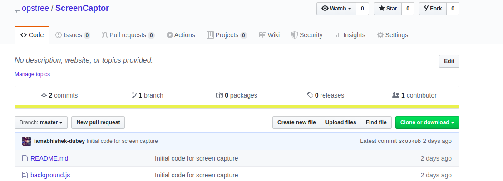
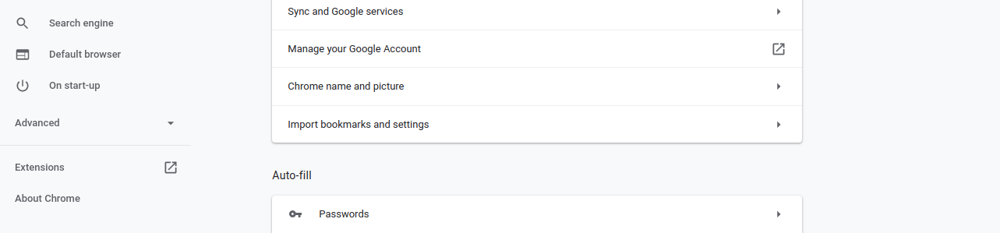
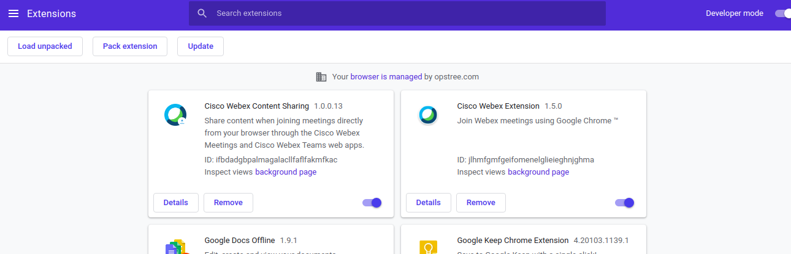
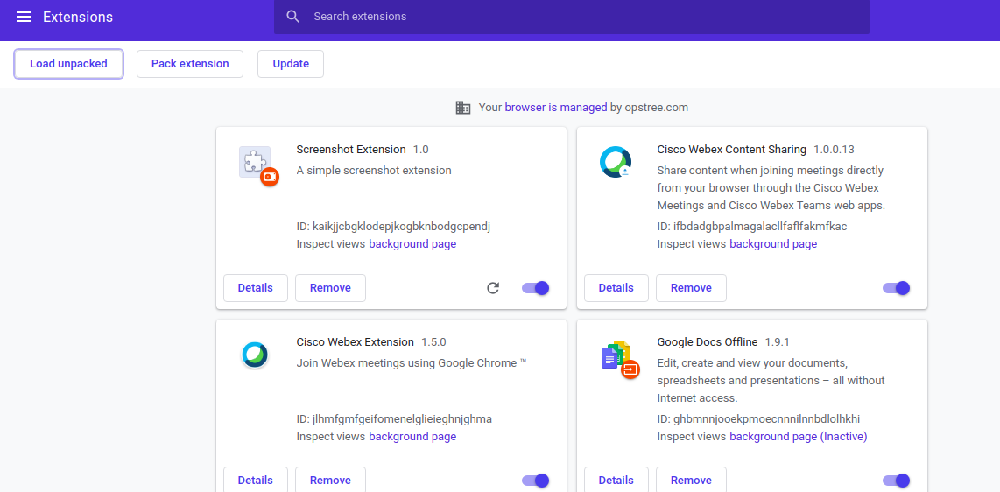

  

# ScreenCapture

A chrome extension to capture your all screen activities in form of screenshot and save it on your system.

## Requirements

- Chrome should be installed.
- Chrome version should be > 70.
- Developer mode setting should be enabled in your chrome.

## Usage

- Clone or download the repo in your system.

- Once code is in your system, open chrome settings and click on extensions.

- Enabled the Developer mode in extensions.

- After that click on **Load Unpacked** and upload the complete plugin directory.

- Once plugin is installed you are all set to use it.
